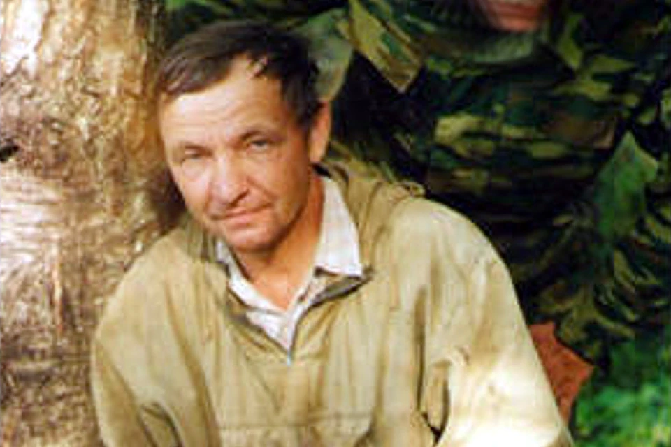

# Юрий Николаевич Тарасов

Юрий Николаевич Тарасов — поисковик из Тверской области, который много лет занимался поиском людей, погибших в Великую Отечественную войну, и, в частности, военных лётчиков, в мечту о которых он был влюблён очень давно, когда в его родную деревню в детстве приехал его дядя — военный лётчик. Это оставило глубокий след в его жизни.

Эта книга написана им о поиске — его наследие.

📖 [Взлетели навечно](Vzleteli-navechno.doc)

